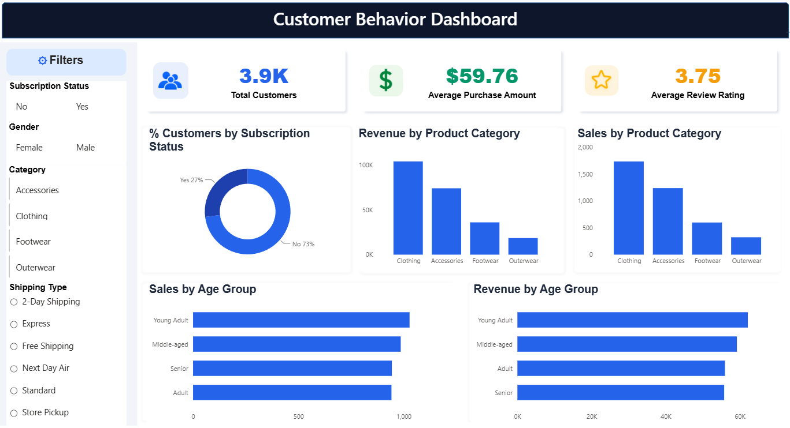

# Customer Shopping Behavior Analysis

## 📌 Project Overview

This project analyzes customer shopping behavior using transactional data to uncover purchasing trends, customer preferences, and revenue patterns. The project combines **Python**, **PostgreSQL**, and **Power BI** to perform data cleaning, business analysis, and interactive visualization, enabling data-driven business decisions. The project follows the workflow outlined in the project brief, including data preparation, SQL analysis, dashboard creation, reporting, and GitHub documentation.

---

## 🎯 Business Problem

A retail company wants to understand customer shopping behavior to improve sales, customer engagement, and long-term customer loyalty by analyzing demographic information, purchasing behavior, product categories, discounts, subscriptions, and shopping trends. 

---

## 🛠️ Technologies Used

- Python
- Pandas
- NumPy
- Matplotlib
- PostgreSQL
- SQL
- Power BI
- Jupyter Notebook

---

## 📂 Dataset Information

- **Dataset:** Customer Shopping Behavior Dataset
- **Records:** 3,900
- **Columns:** 18

### Dataset includes:

- Customer Demographics
- Purchase Details
- Product Categories
- Subscription Status
- Shipping Type
- Purchase Amount
- Review Rating
- Discount Applied
- Purchase Frequency
- Season
- Location

The project also addresses missing review ratings and engineers additional features such as customer age groups and purchase frequency before loading the cleaned data into PostgreSQL for analysis.

---

## 📊 Project Workflow

### 1️⃣ Data Preparation (Python)

- Data Cleaning
- Missing Value Handling
- Feature Engineering
- Data Transformation
- Exploratory Data Analysis
- PostgreSQL Integration

### 2️⃣ Business Analysis (SQL)

Performed SQL analysis to answer business questions including:

- Revenue by Gender
- High Spending Customers
- Top Rated Products
- Shipping Type Comparison
- Subscribers vs Non-Subscribers
- Discount Analysis
- Customer Segmentation
- Top Products by Category
- Repeat Buyers Analysis
- Revenue by Age Group

The SQL analysis covers business questions such as revenue by gender, high-spending discount users, product ratings, shipping comparison, subscription analysis, customer segmentation, top products by category, repeat buyers, and revenue by age group.

### 3️⃣ Dashboard Development (Power BI)

Designed an interactive Power BI dashboard to visualize customer shopping insights and support business decision-making.

---

# 📈 Dashboard Preview



---

## 📌 Dashboard Features

- Total Customers KPI
- Average Purchase Amount
- Average Review Rating
- Revenue by Product Category
- Sales by Product Category
- Subscription Status Analysis
- Sales by Age Group
- Revenue by Age Group
- Interactive Filters
  - Gender
  - Category
  - Subscription Status
  - Shipping Type

---

## 📊 Key Insights

- Clothing generated the highest revenue among all product categories.
- Young Adults contributed the highest revenue.
- Most customers were non-subscribers.
- Average purchase amount was approximately **$59.76**.
- Average customer review rating was **3.75**.
- Loyal customers formed the largest customer segment.

These findings are supported by the SQL analysis and Power BI dashboard. 

---

## 💼 Business Recommendations

- Improve subscription benefits to increase customer retention.
- Reward loyal customers through personalized loyalty programs.
- Promote top-rated products in marketing campaigns.
- Optimize discount strategies without reducing profitability.
- Focus marketing efforts on high-revenue customer segments.

These recommendations are derived from the project analysis. 

---

## 📁 Repository Structure

```
Customer-Shopping-Behavior-Analysis
│
├── Customer Shopping Behavior Analysis.ipynb
├── SQL_Queries.sql
├── customer_shopping_behavior.csv
├── Customer Shopping Behavior Analysis Report.pdf
├── Customer-Shopping-Behavior-Analysis-Slides.pdf
├── README.md
├── LICENSE
└── .gitignore
```

---

## ▶️ How to Run

1. Clone the repository

```bash
git clone https://github.com/your-username/Customer-Shopping-Behavior-Analysis.git
```

2. Install required Python libraries

```bash
pip install pandas numpy matplotlib
```

3. Open the Jupyter Notebook

```
Customer Shopping Behavior Analysis.ipynb
```

4. Import the cleaned dataset into PostgreSQL.

5. Execute the SQL queries from:

```
SQL_Queries.sql
```

6. Open the Power BI dashboard to explore interactive visualizations.

---

## 👨‍💻 Author

**Pranav E**

Aspiring Data Analyst

**Skills**

- Python
- SQL
- PostgreSQL
- Power BI
- Data Analysis
- Data Visualization

